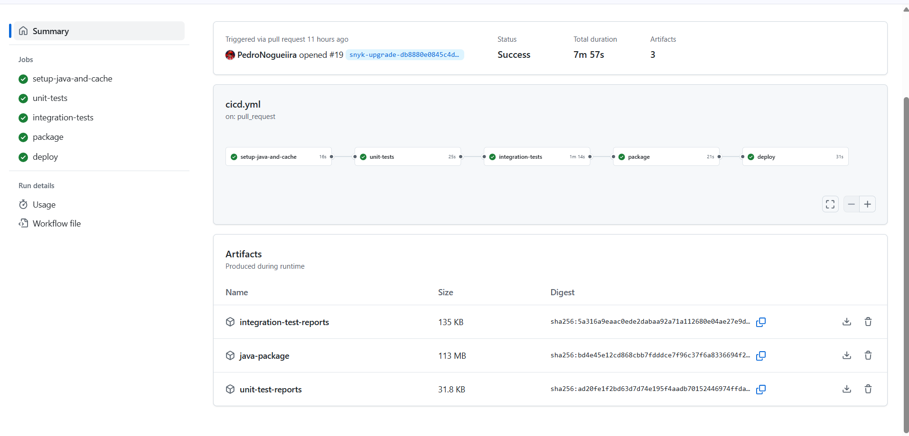

# Phase 2: Sprint 2 - Development, Testing, and Deployment

## Introduction

Phase 2: Sprint 2 focuses on integrating secure development practices with automated build, test, and deployment workflows. The aim is to ensure that the developed application adheres to industry security standards while maintaining high code quality and operational efficiency. This sprint emphasizes the use of DevSecOps tools and processes, including static and dynamic code analysis, automated pipelines, and robust security assessments.

## Topics

### 1. DevSecOps Pipeline
- **Overview of CI/CD Tools Used**: The DevSecOps pipeline is implemented using **GitHub Actions Workflow**. This tool enables automation of build, test, security scanning, and deployment stages directly from the GitHub repository. The workflow files are version-controlled and integrated with pull requests to ensure that every code change passes through a consistent and secure pipeline.
- **Security Integration Points in the Pipeline**: Security checks, including static code analysis and dependency scanning, are integrated as stages within the GitHub Actions workflow.
- **Automation Scripts and Configurations**: Custom scripts and predefined GitHub Actions are used to automate tasks such as linting, unit testing, security analysis, and Docker image building.

#### Overview of CI/CD Workflow

- **Trigger Conditions**: The workflow triggers on:
    - Push events to the `master` branch
    - Pull requests targeting `master`
    - Manual triggers via `workflow_dispatch`

- **Jobs Defined in the Workflow**:

    - **`setup-java-and-cache`**:
        - Sets up JDK 17.
        - Caches Maven dependencies to speed up build times in subsequent runs.

    - **`unit-tests`**:
        - Runs JUnit-based unit tests using the `mvn test` command.
        - Uploads Surefire reports as artifacts.

    - **`integration-tests`**:
        - Runs integration tests using a temporary PostgreSQL service.
        - Waits for PostgreSQL to be healthy and creates a test database.
        - Executes `mvn verify` with an integration profile.
        - Uploads Failsafe test reports.

    - **`package`**:
        - Packages the application into a `.jar` file.
        - Skips all tests during this phase (assumed already verified).
        - Uploads the generated JAR as an artifact.

    - **`deploy`**:
        - Downloads the packaged artifact.
        - Starts the application and its dependencies using Docker Compose.
        - [Optional/Commented] Run OWASP ZAP for DAST (Dynamic Application Security Testing).
        - Stops Docker Compose services after the job completes or fails.

#### Security Integration

- Secrets (e.g., `POSTGRES_USER`, `POSTGRES_PASSWORD`, `PGPASSWORD`) are stored securely using GitHub Secrets and injected into the workflow.
- The commented-out section demonstrates preparation for integration with **OWASP ZAP**, a tool used for dynamic security scanning.
- Artifacts like test reports and ZAP scan results are stored for analysis.

#### Pipeline Diagram

This image visually represents the stages of the pipeline, including the flow from code push to deployment and optional security scanning.

### 2. Code Reviews
- Code review strategy and frequency
- Tools used (e.g., GitHub PRs, Gerrit)
- Metrics or feedback mechanism

### 3. Static Application Security Testing (SAST)
- Tools used (e.g., SonarQube, Checkmarx)
- Ruleset and customization
- Findings and remediation

### 4. Dynamic Application Security Testing (DAST)
- DAST tools and configurations
- Scope of dynamic testing
- Identified vulnerabilities and fixes

### 5. Interactive Application Security Testing (IAST)
- IAST setup and instrumentation
- Real-time analysis during testing
- Observed benefits and limitations

### 6. Software Composition Analysis (SCA)
- Dependency scanning tools (e.g., OWASP Dependency-Check)
- Vulnerability reports from third-party components
- License compliance checks

### 7. Security Testing
- Manual and automated security test cases
- Penetration testing scope and tools
- Integration with QA workflows

### 8. Security Configuration and Installation
- Secure configuration defaults
- Hardening guides applied
- Container and deployment security

### 9. Security Assessment
- Overall security posture evaluation
- Assessment methodology
- Summary of findings and mitigation efforts

### 10. ASVS Traceability
- Mapping of security controls to ASVS requirements
- Traceability between security requirements and test results
- Assessment completeness

### 11. Build and Test Documentation
- Component inventory and versioning
- Test plans and execution logs
- Configuration validation reports
